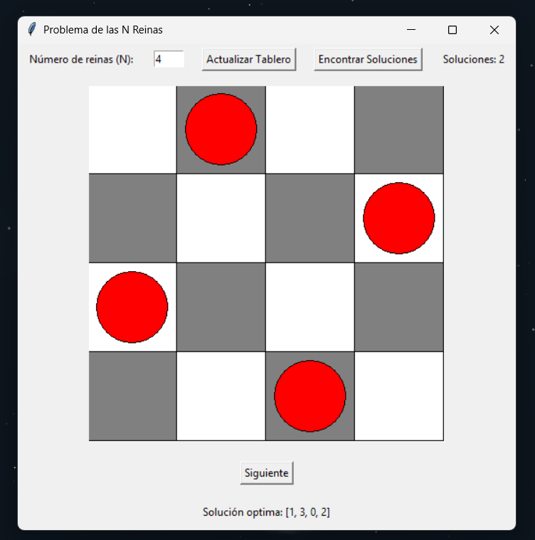
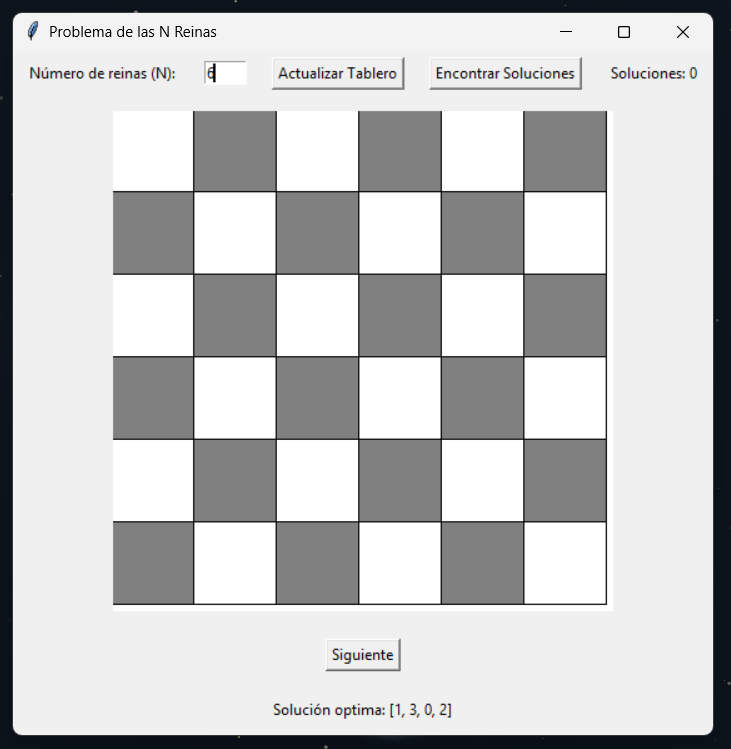
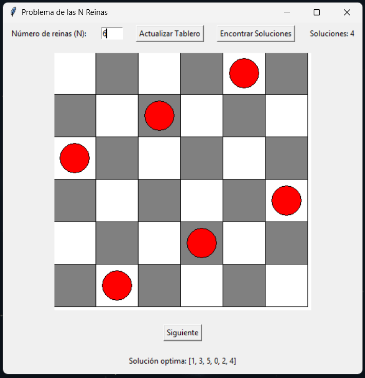
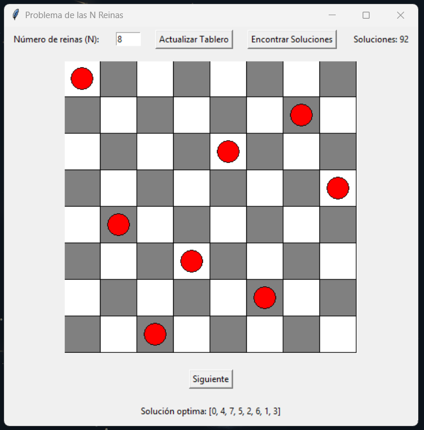

# Problema de las N reinas
# N-Queens Visualizer



  


**N-Queens Visualizer** is a visual and interactive implementation of the classic N-Queens problem, built with Python. This algorithmic puzzle consists of placing N queens on an N×N chessboard so that no two queens threaten each other — no same row, column, or diagonal.

This project turns the logic into an engaging visual experience, perfect for learning, teaching, or simply exploring algorithmic beauty.

---

## ✨ Features

- Dynamically adjustable board size
- Fast and efficient solution using backtracking
- Graphical visualization of every solution
- Clean and responsive UI
- Built with simplicity and education in mind

---

## 📸 Screenshots

**Step 1: Select board size**  
You can choose the size of the board before generating solutions. Here's an example with a 6x6 board:



**Step 2: Example of a solution**  
Once a valid arrangement is found, the board updates to display the positions of the queens:



**Another example on an 8x8 board**  
The classic version of the problem with eight queens placed correctly:



---

## 🧰 Technologies

This project is powered by:

- **Python 3** – Programming language used for the core logic and UI
- **Tkinter** – Standard Python GUI toolkit for rendering the chessboard and queens
- **Virtual Environments** – For isolated and clean dependencies
- **requirements.txt** – To install necessary packages with ease

---

## ⚙️ Installation

Clone this repository and run the app locally with just a few commands:

```bash
git clone https://github.com/Luis3Fernando/N-Queens-Algorithm-Visual
cd N-Queens-Visualizer
python3 -m venv venv
source venv/bin/activate     # On Windows use: venv\Scripts\activate
pip install -r requirements.txt
python3 app.py
